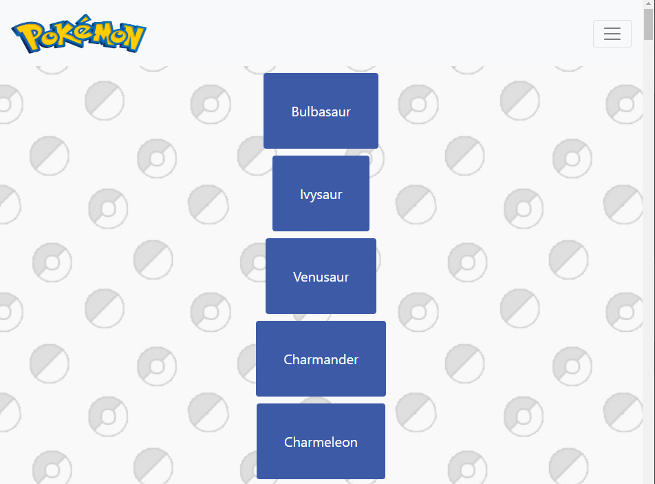
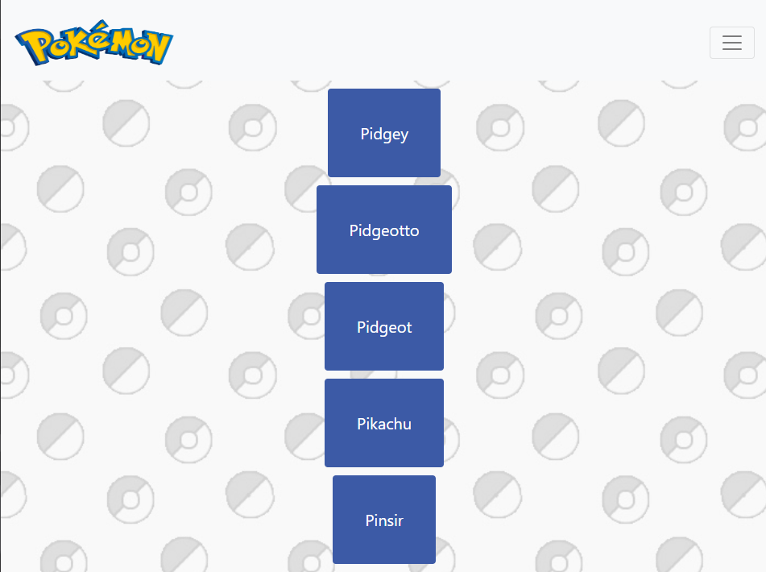
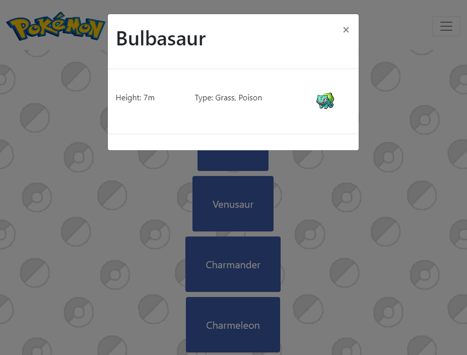

## How Was This App Made?
A JavaScript app built with HTML, CSS, and JavaScript, which uses an
external API.

## What Does This App Do?
It displays all original 150 Pokemon through the Pokemon API. 

Users are able to find a particular Pokemon through the search bar. 
By clicking on the name of the Pokemon, users are able to view the height and type of the pokemon alongside an image. 

## Where Can I Visit This Site?
This website can be viewed through this [link](https://henryn05.github.io/pokedex/).

